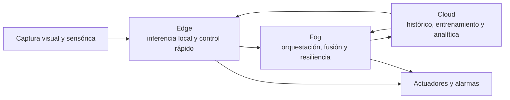

# Visión distribuida AIoT en Edge, Fog y Cloud

## Resumen ejecutivo

El archivo subido deja claro que el encargo original no estaba realmente perdido: pedía investigar aplicaciones reales de sistemas de visión distribuida basados en AIoT sobre arquitecturas Edge–Fog–Cloud en cuatro dominios —automatización industrial, tráfico y seguridad vial, monitoreo ambiental y agricultura de precisión—, con el foco puesto en qué parte de la infraestructura puede mantenerse y qué parte debe cambiar según el caso de uso. Por eso, el análisis más riguroso no consiste en especular sobre posibles prompts alternativos, sino en ejecutar el encargo técnico efectivamente recuperado. fileciteturn0file0

La evidencia revisada muestra un patrón robusto: la capa **Edge** concentra captura, inferencia y control de baja latencia; la capa **Fog** agrega orquestación local o regional, fusión de eventos y continuidad operativa ante desconexiones; la capa **Cloud** aporta histórico, entrenamiento, analítica longitudinal, intercambio entre sitios y gobierno de datos. Ese patrón aparece con diferencias de implementación, pero con la misma lógica funcional, en manufactura, movilidad, emergencia ambiental y agro. citeturn20view0turn21view0turn22view0

Las implantaciones más maduras y convincentes del conjunto analizado son: manufactura con inspección visual integrada a MES y control distribuido; tráfico con control adaptativo en gabinete y coordinación de corredores; detección temprana de incendios con redes masivas de cámaras, IA y modelos predictivos; y pulverización selectiva e instrumentación rural con visión en máquina y gateways resilientes a conectividad deficiente. En todos los casos, el beneficio frente al enfoque tradicional proviene de reducir transporte de video bruto, acortar el lazo sensor–decisión–actuación y reservar la nube para lo que realmente gana con centralización. citeturn4view0turn7view0turn11view0turn11view2turn31view0turn24view0

## Reconstrucción del encargo y criterio de análisis

El supuesto de trabajo, por lo tanto, es explícito: **el prompt original sí puede reconstruirse** a partir del archivo aportado, y corresponde a una **pregunta de investigación técnica y aplicada**, no a una tarea de programación pura ni a planificación de viajes. El informe se organiza alrededor de esa hipótesis confirmada por la fuente primaria subida a la conversación. fileciteturn0file0

Para responderla con el mayor nivel de confianza posible, se priorizaron publicaciones normativas y documentos técnicos de referencia, páginas oficiales de programas desplegados y artículos científicos con casos de implementación. El criterio comparativo fue constante en los cuatro dominios: arquitectura, hardware y software, integración con sistemas existentes, tipo de modelo visual, mecanismo de actuación, mejora frente al método tradicional y límites prácticos de despliegue. Esa forma de comparación es coherente con la propia redacción del encargo recuperado. fileciteturn0file0

## Arquitectura base de la visión distribuida

En términos conceptuales, entity["organization","National Institute of Standards and Technology","us standards agency"] define fog como un modelo en capas que ubica nodos entre dispositivos finales y servicios centralizados, con despliegue distribuido, sensible a latencia y orientado a reducir tiempos de respuesta. El mismo documento distingue edge como la periferia inmediata de dispositivos y usuarios, mientras que fog agrega jerarquía, almacenamiento, control y aceleración del procesamiento. El marco de entity["organization","OpenFog Consortium","fog computing consortium"], posteriormente adoptado por entity["organization","IEEE","engineering standards org"] como IEEE 1934, refuerza esa lectura con ocho pilares arquitectónicos —seguridad, escalabilidad, apertura, autonomía, RAS, agilidad, jerarquía y programabilidad— y subraya que las implementaciones reales suelen ser multinivel, no solo “dispositivo más nube”. citeturn20view0turn21view0turn1search24

Para que esa arquitectura sea realmente reutilizable entre dominios, hace falta un plano de interoperabilidad. Ahí entra entity["organization","OPC Foundation","industrial interoperability org"]: su especificación describe OPC UA como estándar de intercambio de información seguro, confiable, independiente de fabricante y válido tanto para comunicaciones horizontales como verticales, desde shop floor hasta cloud. En visión industrial, el documento de entity["company","Siemens","industrial automation company"] sobre OPC UA Vision es especialmente útil porque explicita algo que en otros dominios aparece de forma más implícita: la capacidad de conectar sistemas de visión con controladores, MES, SCADA, ERP y nube sin rehacer toda la pirámide de automatización. citeturn22view0turn25view0turn5search5

El diagrama resume el patrón común observado en las fuentes normativas y en los casos operativos estudiados: lo que cambia por dominio son los modelos, las reglas y los actuadores; lo que se mantiene es la separación funcional entre decisión inmediata, coordinación intermedia y aprendizaje/analítica a escala. citeturn20view0turn21view0turn22view0turn4view0turn7view0turn11view2turn24view0

image_group{"layout":"carousel","aspect_ratio":"16:9","query":["industrial machine vision production line smart camera","adaptive traffic signal intersection camera edge AI","wildfire detection camera tower California","precision agriculture smart sprayer computer vision field"],"num_per_query":1}

## Aplicaciones en automatización industrial

El caso industrial más completo encontrado no es un simple piloto de cámara inteligente, sino una transformación de un sistema de producción modular hacia una arquitectura con MES, fog computing y nube. En ese trabajo, la estación de control de calidad usa visión por computador con OpenCV, clasificadores en cascada, HSV y Canny para distinguir piezas correctas y defectuosas; la estación fog distribuye carga entre nodos FCS y un nodo maestro; y la capa cloud incorpora broker MQTT, Node-RED, base MySQL y servicios en EC2 para órdenes remotas, inventario y supervisión. La integración con el proceso físico se realiza mediante señales AS-i y retrofits sobre control previo, lo que muestra que la visión distribuida industrial no depende de greenfield total: puede injertarse sobre activos legacy. citeturn4view0turn25view0

Ese caso es especialmente valioso porque permite separar con claridad lo que queda fijo y lo que cambia. La infraestructura base es estable: captura local, procesamiento cercano, mensajería ligera, orquestación de tareas y persistencia remota. Lo que cambia son los módulos de visión y los criterios de decisión. En la misma celda de manufactura se ejecutan inspección de calidad, reconocimiento facial y un proceso artificialmente pesado para inducir sobrecarga y validar la redistribución fog. El trabajo reporta que el MES mantuvo conexión bidireccional con la nube, que el nodo maestro impuso una restricción de orquestación cuando el uso de CPU superó 60%, y que la temperatura media de los nodos FCS se mantuvo alrededor de 43 °C; además, la reestructuración del proceso redujo tiempos de espera y reabastecimiento en aproximadamente 30%. citeturn4view0

Frente al método tradicional, la superioridad no está solo en detectar defectos. Está en cerrar el bucle entre resultado visual y ejecución industrial. En la práctica, eso significa inspección 100% en línea, clasificación inmediata, sincronización con stock y órdenes, y posibilidad de escalar a otras funciones OT/IT sin multiplicar interfaces propietarias. La principal limitación es que la evidencia procede de un entorno modular de investigación-aplicación, no de una planta multisede a gran escala; aun así, el valor metodológico es alto porque hace visible la arquitectura completa, desde cámara hasta nube, con integración explícita a control industrial y mensajería estándar. citeturn4view0turn25view0

## Aplicaciones en tráfico y seguridad vial

En movilidad urbana, la literatura y los casos revisados muestran dos subproblemas distintos: **control adaptativo local** y **seguimiento distribuido multiintersección**. Para el primero, el caso de entity["city","Pyeongtaek","gyeonggi, kr"] instala intersecciones “smart” en tres cruces consecutivos, analiza video de CCTV en dispositivos edge in situ y comprime el modelo para que funcione en hardware de potencia limitada. El artículo reporta que el modelo optimizado mantuvo 93.64% de precisión aunque su tamaño se redujo 97.8%, y que las restricciones del método se diseñaron para seguir siendo compatibles con el sistema semafórico legado. Esa compatibilidad con infraestructura existente es clave: en tránsito, como en industria, lo que más frena el despliegue no es el algoritmo sino la fricción con el parque instalado. citeturn29search1

Para medir impacto en calle real, el estudio de entity["city","El Salvador City","misamis oriental, ph"] resulta más fuerte que muchos demos de laboratorio. Allí, un controlador adaptativo basado en cámaras montadas en gabinete y cómputo completamente local redujo el retraso medio por vehículo entre 18% y 32%, permitió atender aproximadamente entre 50 y 200 vehículos adicionales por hora en los accesos más cargados y siguió operando aun con interrupciones de backhaul, porque las decisiones se ejecutan dentro del gabinete semafórico. Además, el sistema deja trazas por ciclo para auditoría y gobierno, un detalle operativo importante en despliegues urbanos reales. citeturn7view0

El segundo subproblema —seguimiento distribuido— cambia la regla pero no la arquitectura. El sistema WatchDog, evaluado con trayectorias vehiculares urbanas reales de entity["city","Shenzhen","guangdong, cn"], distribuye tareas de reidentificación entre nodos edge geográficamente dispersos para evitar “tracking loss” en intersecciones congestionadas. El trabajo justifica el edge por tres razones: ancho de banda, latencia y privacidad; además, muestra retrasos medios de reidentificación inferiores a cuatro minutos incluso en horas pico y menos de catorce nodos implicados en el seguimiento de un objetivo de interés. No es un despliegue municipal completo, sino una evaluación rigurosa sobre datos urbanos a escala de ciudad, pero sirve para demostrar que ANPR, reidentificación, clasificación por color o seguimiento de incidentes pueden incorporarse como módulos especializados sobre la misma malla Edge–Fog–Cloud. citeturn8view0

En comparación con semáforos pretemporizados o lazo inductivo tradicional, la visión distribuida gana porque observa geometría, colas, giros, peatones y contexto. Pierde, en cambio, cuando falla la gobernanza de datos, la calibración o la visibilidad física por clima, oclusión o mantenimiento de cámaras. Ese balance sugiere que el enfoque correcto no es “reemplazar todo por visión”, sino usar visión en borde para los cruces de mayor variabilidad y reservar niveles fog o cloud para coordinación intersección, trazabilidad y optimización de red. citeturn29search1turn7view0turn8view0

## Aplicaciones en monitoreo ambiental y emergencias

El caso más sólido y operativo en monitoreo ambiental es entity["organization","ALERTCalifornia","uc san diego program"], un programa basado en entity["organization","University of California San Diego","california university"] en coordinación con entity["organization","CAL FIRE","california fire agency"]. Su red supera las mil cámaras PTZ de alta definición; las cámaras realizan barridos de 360 grados aproximadamente cada dos minutos, con doce cuadros HD por barrido, visión nocturna infrarroja cercana y alcance visual de hasta 60 millas de día y 120 de noche en condiciones favorables. La función operativa no es solo “ver humo”: también confirmar igniciones, escalar recursos, apoyar evacuaciones y seguir el comportamiento del fuego durante la contención. citeturn11view1turn11view3turn10search18

La capa analítica añade IA y modelado predictivo. El sistema de detección temprana desarrollado entre el programa estatal, la agencia forestal y un socio industrial alerta con una localización estimada y nivel de certeza; en su primera temporada operó en los 21 centros de despacho y detectó más de 1,200 incendios, adelantándose a los reportes al 911 en más del 30% de los casos. Un ejemplo oficial muestra una detección a las 5:19 a. m. y la primera llamada al 911 a las 6:01 a. m.; la respuesta temprana permitió contener el fuego por debajo de un cuarto de acre. En paralelo, el sistema WIFIRE generó mapas predictivos en minutos desde las primeras señales de humo y, durante el evento extremo de enero de 2025, atendió aproximadamente 230 inicios y publicó modelos para 12 incendios verificados con potencial de gran crecimiento. citeturn30search0turn11view0turn11view2

Aquí el contraste con el método tradicional es el más dramático del informe. Pasar de “operadores mirando muchas pantallas” a “detección asistida por IA más modelado de propagación y sensado aéreo” no solo baja fatiga, sino que cambia la cronología de respuesta. Sin embargo, el caso también deja ver una limitación importante: la validación humana sigue siendo necesaria y la infraestructura depende de línea de visión, comunicación robusta y gestión de falsos positivos. Esa es exactamente la razón por la que los trabajos de edge puro siguen siendo relevantes: un sistema reciente sobre Raspberry Pi 5 para fuego y humo alcanzó 97.98% de exactitud de prueba y 0.77 s de latencia por cuadro, operando sin dependencia de cloud. No describe la red californiana, pero sí muestra cómo la misma arquitectura puede empujar inferencia más cerca del sensor cuando la conectividad remota es más frágil. citeturn15search0turn11view1turn11view0

## Aplicaciones en agricultura de precisión

En agro, la madurez comercial más visible está hoy en la visión montada en máquina. El sistema de pulverización selectiva de entity["company","John Deere","ag machinery company"] usa cámaras en la barra, módulos de visión y procesadores embebidos para identificar malezas y activar solo las boquillas necesarias. La página técnica oficial describe ahorro medio de herbicida del 77% en barbecho sobre 75,000 acres evaluados; el material de producto explica que las cámaras escanean continuamente el lote, que la identificación ocurre en milisegundos y que el sistema documenta lo aplicado y lo no aplicado en mapas enviados a la cuenta de operaciones del productor. Una publicación técnica adicional de la misma empresa precisa que las cámaras pueden escanear más de 2,000 pies cuadrados por segundo y que la detección–disparo ocurre dentro de una ventana de 200 ms. citeturn31view0turn31view2

Ese caso muestra mejor que ningún otro cómo una misma base Edge–Fog–Cloud se traduce en actuadores distintos: aquí no se abren barreras ni se disparan alarmas, sino boquillas ExactApply. También muestra que la frontera entre fog y edge puede ser “in-cab” o “in-machine”, no necesariamente un microcentro de datos separado. La versión Ultimate reporta además reducción superior al 50% en volumen aplicado frente a pulverización broadcast en maíz, algodón y soja; y la empresa comunica un aumento medio de +131 kg/ha en soja en estudios patrocinados con terceros. Ese último dato es útil, pero debe leerse con cautela porque no es un metaanálisis independiente sino evidencia patrocinada por el proveedor. citeturn31view1

El otro gran problema agrícola no es la pulverización, sino la conectividad rural para combinar cámaras, drones y sensores. Allí el proyecto de entity["company","Microsoft","software company"] FarmBeats aporta una arquitectura de referencia especialmente valiosa: plantea un sistema end-to-end con sensores, cámaras y drones; añade conectividad local híbrida y un gateway en la granja capaz de operar independientemente durante cortes de red; y ya en 2017 había realizado despliegues de seis meses en dos granjas estadounidenses. El artículo fundacional reporta más de 10 millones de mediciones, 1 millón de imágenes y 100 videos de dron; reducción del downtime de la estación base a cero frente a más del 30% en la versión previa; compresión mediana de 1000× de video aéreo a resúmenes útiles para nube; disponibilidad local incluso durante una semana de caída de Internet; y mejora del 30% en el área cubierta por vuelo mediante planificación asistida por viento. La página oficial del proyecto resume el mismo problema con una frase que sigue vigente: muchas granjas no tienen energía en campo ni Internet confiable, por lo que la solución debe ir “de sensores a cloud” sin asumir conectividad continua. citeturn24view0turn32view0

La comparación con el enfoque tradicional es clara. La pulverización broadcast trata el lote como homogéneo; los despliegues densos de sensores enterrados asumen conectividad y costos que muchas explotaciones no soportan; y el envío masivo de video crudo a la nube es inviable en muchísimos contextos rurales. La visión distribuida agrícola funciona mejor cuando la inferencia primaria y el filtrado suceden en la máquina o en el gateway, mientras la nube conserva el papel de historial, tablero de decisiones y orquestación multiestación. citeturn31view0turn24view0turn32view0

## Conclusiones comparativas

El hallazgo central del informe es que la “misma” arquitectura no significa el “mismo” sistema. Lo que permanece de dominio a dominio es la partición funcional del trabajo; lo que se reemplaza son los modelos de percepción, las reglas de negocio y los actuadores. En manufactura, el sistema decide **buena/mala** y sincroniza logística; en tráfico, recalcula verdes y distribuye seguimiento; en incendios, emite alertas y predicciones; en agro, abre boquillas y genera prescripciones. Esa reusabilidad parcial es justamente lo que hace realista pensar en una base común de infraestructura y, a la vez, evita el error de vender “una plataforma universal” sin adaptación sectorial. citeturn4view0turn7view0turn11view2turn31view0turn24view0

| Dominio | Edge | Fog | Cloud | Actuación principal | Evidencia operativa |
|---|---|---|---|---|---|
| Automatización industrial | Cámaras y procesamiento local de calidad | Nodo maestro distribuye carga, sincroniza estaciones y protege recursos | Inventario, órdenes y respaldo remoto | Clasificación de piezas, despacho, reposición | Arquitectura con MES, visión OpenCV, MQTT, Node-RED y base remota; ~30% de mejora en tiempos de espera y reabastecimiento. citeturn4view0turn25view0 |
| Tráfico y seguridad vial | Cámaras en gabinete, inferencia on-site y control por ciclo | Coordinación de corredores o colaboración entre nodos distribuidos | Telemetría, auditoría y optimización de red | Ajuste semafórico, alertas y seguimiento multiintersección | Reducción de retraso de 18–32% y 50–200 veh/h extra en despliegue urbano; precisión de 93.64% con compresión 97.8% en smart intersections; seguimiento distribuido con retrasos <4 min. citeturn7view0turn29search1turn8view0 |
| Monitoreo ambiental y emergencias | Captura continua con cámaras PTZ e IA de detección temprana | Centros de mando y fusión en tiempo real con recursos aéreos | Modelado predictivo, archivo y análisis longitudinal | Confirmación de ignición, despacho, evacuación y seguimiento | Red >1,000 cámaras; >1,200 incendios detectados en primera temporada; ventaja sobre 911 en >30% de casos; mapas predictivos en minutos. citeturn11view1turn30search0turn11view0turn11view2 |
| Agricultura de precisión | Visión en barra, módulos de pulverización, drones y sensores | Gateway de granja y cómputo local resiliente a cortes | Tableros de operación, histórico y analítica intercampaña | Apertura selectiva de boquillas, mapas de aplicación y recomendaciones | 77% de ahorro medio de herbicida en barbecho; >50% de reducción de volumen en cultivos seleccionados; seis meses de despliegue rural con cero downtime de estación base y 1000× de compresión útil. citeturn31view0turn31view1turn24view0turn32view0 |

La principal limitación transversal es que no todos los dominios exponen con el mismo detalle sus costos totales, su ciberseguridad operativa o su desempeño en escenarios extremos. En industria y agro aparecen más datos de integración OT/IT y ahorro de insumos; en incendios hay más evidencia de respuesta temprana que de benchmarking independiente; en tráfico todavía abundan estudios híbridos entre despliegue y simulación. Aun así, la convergencia de fuentes normativas, casos oficiales y estudios aplicados permite una conclusión firme: **Edge–Fog–Cloud sí constituye una base reutilizable para visión distribuida, pero solo si se diseña como arquitectura adaptable y no como aplicación cerrada**. Las preguntas abiertas más importantes son la estandarización de actualización segura de modelos, la ubicación óptima del fog en cada vertical, y la generación de métricas comparables de costo, precisión y resiliencia entre despliegues. citeturn20view0turn25view0turn8view0turn24view0turn11view0